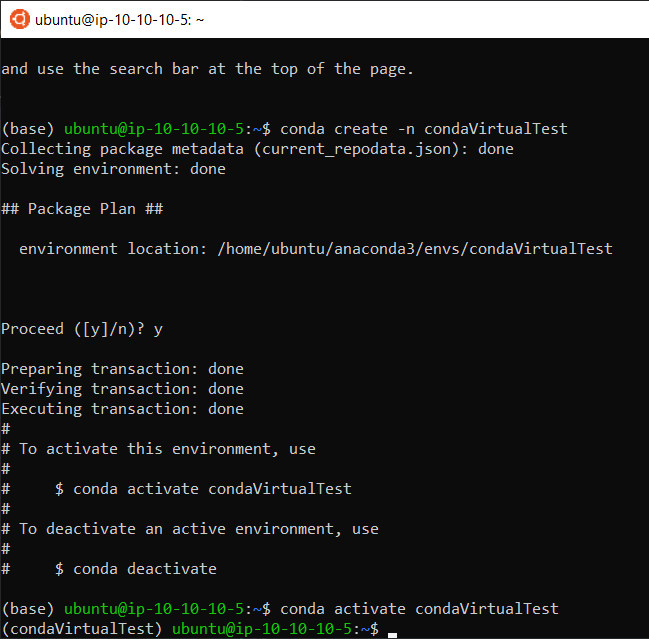
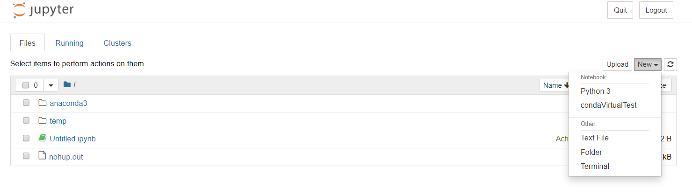

# Ubuntu_Jupyter_and_Virtual_Environments
## Running a Jupyter server and working with virtual Environments

In this project, we'll install Jupyter on an AWS Ubuntu machine and create virtual environments for our Jupyter notebooks.  
Jupyter will be run in server mode so we can remotely work on Python scripts just connecting from a web browser.

## Introduction: why create virtual environments?

Python comes in different versions (2.7, 3.6, etc) and so do Python packages. Furthermore, some Python packages may rely on specific versions of other packages. This creates strong dependencies, and sometimes incompatibilities. In the long run, different projects may require different package versions, and installing all packages in the same environment may lead to inconsistencies. Virtual environments allow you to avoid this long term issue, by isolating packages and Python versions when you work on a project. They will also ensure your code will work on different machines, regardless of the package versions that were installed on those machines.

## AWS Architecture

A VPC, with Internet Gateway and a public subnet whose route table allows internet routing via the Internet gateway.
An EC2 instance of type Ubuntu server 18.04

## Installing Jupyter on remote Ubuntu machine

Once connected to the instance:

Update the machine  
$ sudo apt-get update -y  

Install and upgrade pip3  
$ sudo apt-get install python3-pip

Install Jupyter  
$ sudo pip3 install jupyter

## Running Jupyter Server

* The Jupyter server runs on port 8888, so we'll need to change our security group accordingly. In Inbound Rules, select Type Custom TCP on Port 8888, source Anywhere.
* To launch the Jupyter server from the Ubuntu machine, 2 options:
 1. $ jupyter notebook --no-browser --ip=0.0.0.0
 2. $ nohup jupyter notebook --no-browser -ip=0.0.0.0 &  

If using option 1, you'll need to be connected to the instance while accessing the notebooks on your web browser.  
Option 2 allows you to launch the server in the background, so that you can disconnect from your instance and still access the jupyter notebooks via your web browser.

In both options, Ubuntu will provide an URL you need to paste in your browser. For option 2, since the server is executed in the background, no prompt is being displayed. You can get the URL in the file nohup.out (just <b>$ cat nohup.out in ubuntu</b>). This URL has the following format: http://ip-10-10-10-5:8888/?token=xxxx  
Just replace <i>ip-10-10-10-5</i> with the public IP of your Ubuntu instance and paste this link in your web browser. You now have access to Jupyter notebooks/terminals running on a remote machine.

## Creating Virtual Environments

### Using venv

* Installation

  $ sudo apt-get install python3-venv

* Creating a new virtual Environments called venvVirtualTest

  $ python3 -m venv venvVirtualTest

* Activating the virtual environment

  $ source venvVirtualTest/bin/activate

### Using Conda

* Installation

  retrieve the download link from https://www.anaconda.com/distribution/#download-section  
  !! Make Sure to select the correct operating system/Python version package !!

  $ curl -O https://repo.anaconda.com/archive/Anaconda3-2019.10-Linux-x86_64.sh  
  $ bash Anaconda3-2019.10-Linux-x86_64.sh

* Creating a new virtual Environments called condaVirtualTest

  $ conda create -n condaVirtualTest

* Activating the virtual Environment

  $ conda activate condaVirtualTest

### Using pew

* Installation

  $ pip install pew

* Creating a new virtual environment called pewVirtualTest

  $ pew new pewVirtualTest

* activating the virtual environment

  $ pew workon pewVirtualTest

## Installing packages in your virtual environments

### Making your virtual environment available from Jupyter notebooks

With your virtual environment activated, from your Ubuntu machine or via a Jupyter terminal open in your web browser, we now need to make this virtual environment available from your Jupyter notebooks. This virtual environment will have its own, isolated list of packages and versions so that no icompatibility may arise.

Note: this step will have to repeated each time you create a new environment.

  $ pip install ipykernel  
  $ ipython kernel install --user --name=condaVirtualTest

You can now create a new Jupyter notebook running under this virtual environment.

Create a new notebook under this environment. The default list of packages that comes with your virtual environment might be limited. For example, mysqlconnector might not be included. You can check this running the following cell code:
import mysql.connector

you might get an error message: ModuleNotFoundError: No module named 'mysql'

All we have to do now is install the package in our virtual environment using pip install :
  $ pip install mysql-connector-python

Go back to your jupyter notebook, rerun the cell import mysql.connector. You should not get an error anymore.

### "Distributing" your virtual environment

Since your project may need specific packages that you installed during development, you'd need to list which packages you used as well as their version before you can distribute your code to a third party. Rather than do this manually, you can run the pip freeze command that will list all the packages installed in your virtual environment.  
We can export this to a text file so that a user may himself run a pip command on that text file and install all the correct packages at once in his virtual environment, thus ensuring he will run the python code you provided from an environment which would be the exact replica of the environment you used to create the code.

* Saving the list of packages into a text file

WITH YOUR VIRTUAL ENVIRONMENT ACTIVATED:  
  $ pip freeze > myPackages.txt

* Recreating a virtual environment with all the packages listed in myPackages.text

A user wanting to run your code with the same package versions you used for development would then only need to run (from their own virtual environment):  
$ pip install -r myPackages.text
